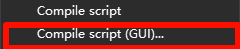
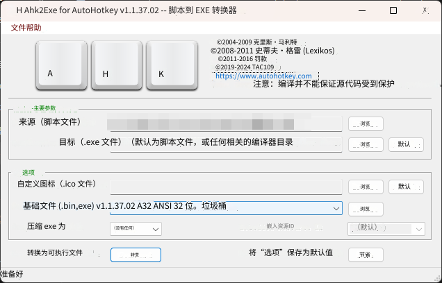

#### 放点杂物看看就好啦🤣🤣🤣
----------
### 所有脚本都是F开始 F结束 F12退出

使用脚本时需要安装 [AutoHotkey_2.0.17_setup](./AutoHotkey_2.0.17_setup.exe)

[连续点击意E键](./脚本/E.ahk)

[间隔十秒跳跃](./脚本/间隔十秒跳跃.ahk)

[鼠标左键连点](./脚本/鼠标左键连点.ahk)

[Roblox游戏秒退出](./脚本/Roblox游戏退出.ahk)

[自动输入thisisunsafe](./脚本/thisisunsafe.ahk)

[自动输入allow pasting](./脚本/allow%20pasting.ahk) **使用时先把控制台改成英文**

## 如何将点ahk打包成exe

### 照着下列图表进行修改即可
